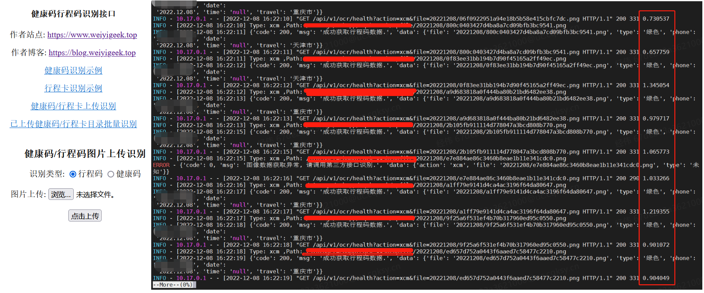
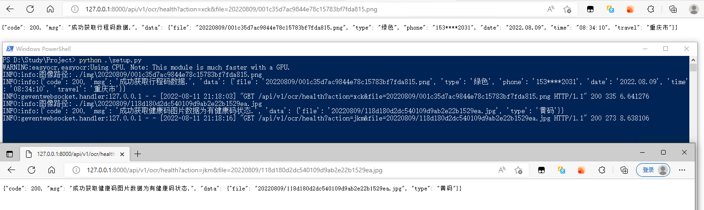
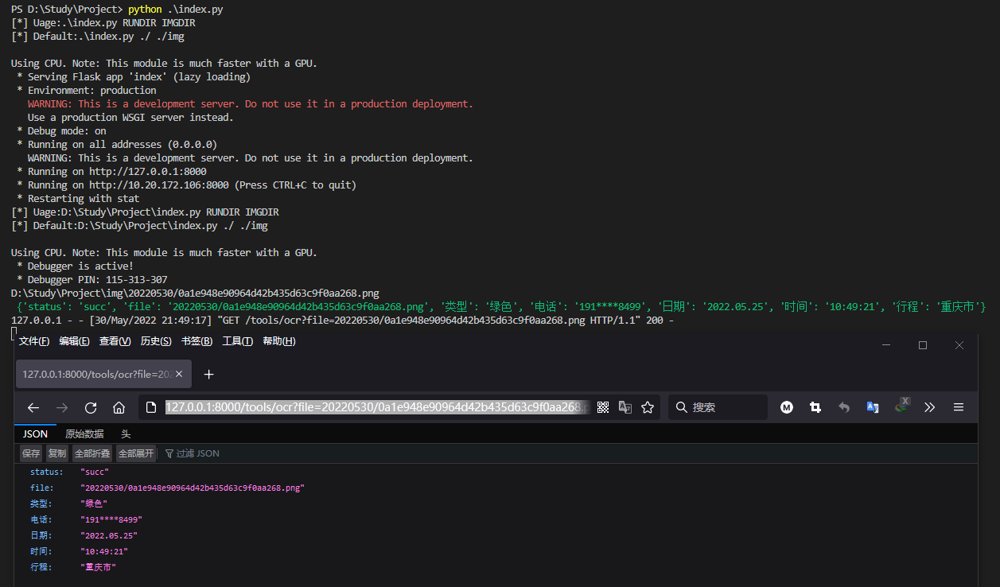

### :hammer_and_wrench: 行程码、健康码图片OCR识别API接口

描述: Python项目基于easyocr模块实现大数据通信行程卡图片识别信息获取，并采用Flask框架进行识别数据返回，供大家分享食用，请大家多多star支持或者关注微信公众号哟!

欢迎访问作者个人主页与博客，以及关注微信公众号【WeiyiGeek】，将会分享更多工具。

个人主页: https://www.weiyigeek.top

博客地址：https://blog.weiyigeek.top

学习交流群：https://weiyigeek.top/visit.html

博客实践原文章 ：https://blog.weiyigeek.top/2022/5-8-658.html

B站专栏 : https://www.bilibili.com/read/cv16911816

Github项目: [https://github.com/WeiyiGeek/SecOpsDev/tree/master/Project/Python/EasyOCR/Travelcodeocr](https://github.com/WeiyiGeek/SecOpsDev/tree/master/Project/Python/EasyOCR/Travelcodeocr)

<br/>

### 环境依赖与模块安装

```bash
pip install flask
pip install easyocr
pip install gevent
pip install gevent-websocket
```

**镜像构建**

```bash
~$ cd /opt/images/easyocr/
/opt/images/easyocr$ ls
Dockerfile  EasyOCR

$ docker build -t harbor.weiyigeek.top/python/easyocr-healthcode:v1.6.2 .
$ docker images
REPOSITORY                                               TAG                    IMAGE ID       CREATED         SIZE
harbor.weiyigeek.top/python/easyocr-healthcode           v1.6.2                 940a65f8a6ec   18 hours ago    7.39GB
```

<br/>

### 项目启动

```python
# 脚本启动命令
python ./setup.py --imgdir=/imgs --logdir=/logs --ip=0.0.0.0 --port=8000 --gpu=True

# 使用k8s的StatefulSet资源控制器部署Pod （此处我在GPU服务器上运行的）
$ kubectl create ns devtest
$ kubectl apply -f healthcode-sts.yaml
$ kubectl get pod -n devtest
NAME             READY   STATUS    RESTARTS   AGE
healthcode-0-5   1/1     Running   0          15h
healthcode-0-4   1/1     Running   0          15h
healthcode-0-3   1/1     Running   0          15h
healthcode-0-2   1/1     Running   0          15h
healthcode-0-1   1/1     Running   0          15h
healthcode-0-0   1/1     Running   0          15h

# 查看 GPU 服务器使用情况
 nvidia-smi
Fri Dec  9 10:08:32 2022
+-----------------------------------------------------------------------------+
| NVIDIA-SMI 465.19.01    Driver Version: 465.19.01    CUDA Version: 11.3     |
|-------------------------------+----------------------+----------------------+
| GPU  Name        Persistence-M| Bus-Id        Disp.A | Volatile Uncorr. ECC |
| Fan  Temp  Perf  Pwr:Usage/Cap|         Memory-Usage | GPU-Util  Compute M. |
|                               |                      |               MIG M. |
|===============================+======================+======================|
|   0  NVIDIA Tesla V1...  Off  | 00000000:1B:00.0 Off |                    0 |
| N/A   41C    P0    36W / 250W |   6697MiB / 32510MiB |      0%      Default |
|                               |                      |                  N/A |
+-------------------------------+----------------------+----------------------+
|   1  NVIDIA Tesla V1...  Off  | 00000000:1D:00.0 Off |                    0 |
| N/A   51C    P0    53W / 250W |   9489MiB / 32510MiB |     14%      Default |
|                               |                      |                  N/A |
+-------------------------------+----------------------+----------------------+
|   2  NVIDIA Tesla V1...  Off  | 00000000:3D:00.0 Off |                    0 |
| N/A   53C    P0    42W / 250W |   5611MiB / 32510MiB |     20%      Default |
|                               |                      |                  N/A |
+-------------------------------+----------------------+----------------------+
|   3  NVIDIA Tesla V1...  Off  | 00000000:3F:00.0 Off |                    0 |
| N/A   37C    P0    35W / 250W |  10555MiB / 32510MiB |      0%      Default |
|                               |                      |                  N/A |
+-------------------------------+----------------------+----------------------+
|   4  NVIDIA Tesla V1...  Off  | 00000000:40:00.0 Off |                    0 |
| N/A   45C    P0    51W / 250W |   5837MiB / 32510MiB |      5%      Default |
|                               |                      |                  N/A |
+-------------------------------+----------------------+----------------------+
|   5  NVIDIA Tesla V1...  Off  | 00000000:41:00.0 Off |                    0 |
| N/A   37C    P0    37W / 250W |  10483MiB / 32510MiB |      0%      Default |
|                               |                      |                  N/A |
+-------------------------------+----------------------+----------------------+

+-----------------------------------------------------------------------------+
| Processes:                                                                  |
|  GPU   GI   CI        PID   Type   Process name                  GPU Memory |
|        ID   ID                                                   Usage      |
|=============================================================================|
|    0   N/A  N/A    167660      C   python                           6693MiB |
|    1   N/A  N/A    166790      C   python                           9485MiB |
|    2   N/A  N/A    165941      C   python                           5607MiB |
|    3   N/A  N/A    165032      C   python                          10551MiB |
|    4   N/A  N/A    164226      C   python                           5833MiB |
|    5   N/A  N/A    163344      C   python                          10479MiB |
+-----------------------------------------------------------------------------+
```

**使用截图**




---

### 历史版本

**v2版本:**
```bash
# 脚本启动
python .\setup.py
  # Using CPU. Note: This module is much faster with a GPU.
  # * Serving Flask app 'index' (lazy loading)
  # * Environment: production
  #   WARNING: This is a development server. Do not use it in a production deployment.
  #   Use a production WSGI server instead.
  # * Debug mode: on
  # * Running on all addresses (0.0.0.0)
  #   WARNING: This is a development server. Do not use it in a production deployment.
  # * Running on http://127.0.0.1:8000
  # * Running on http://10.20.172.106:8000 (Press CTRL+C to quit)
  # * Restarting with stat
  # Using CPU. Note: This module is much faster with a GPU.
  # * Debugger is active!
  # * Debugger PIN: 115-313-307

- # 指定健康码图片文件
> http://127.0.0.1:8000/api/v1/ocr/health?action=jkm&file=20220809/118d180d2dc540109d9ab2e22b1529ea.jpg
{"code": 200, "msg": "成功获取健康码图片数据为有健康码状态.", "data": {"file": "20220809/118d180d2dc540109d9ab2e22b1529ea.jpg", "type": "黄码"}}

- # 指定行程码图片文件
> http://127.0.0.1:8000/api/v1/ocr/health?action=xcm&file=20220530/001c35d7ac9844e78c15783bf7fda815.png
{"code": 200, "msg": "成功获取行程码数据.", "data": {"file": "20220809/001c35d7ac9844e78c15783bf7fda815.png", "type": "绿色", "phone": "153****2031", "date": "2022.08.09", "time": "08:34:10", "travel": "重庆市"}}

- # 批量扫描目录中的行程码图片文件
> http://127.0.0.1:8000/tools/ocr?dir=20220530
- # 上传行程码识别
> http://127.0.0.1:8000/tools/upload/ocr
```

**V1 版本**

```bash
- # 指定行程码图片文件
> http://127.0.0.1:8000/tools/ocr?file=20220530/0a1e948e90964d42b435d63c9f0aa268.png
- # 批量扫描目录中的行程码图片文件
> http://127.0.0.1:8000/tools/ocr?dir=20220530
- # 上传行程码识别
> http://127.0.0.1:8000/tools/upload/ocr
```

### 执行结果

**V2版本:**


**V1 版本**

